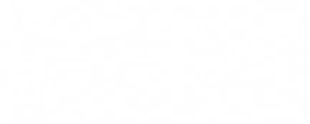
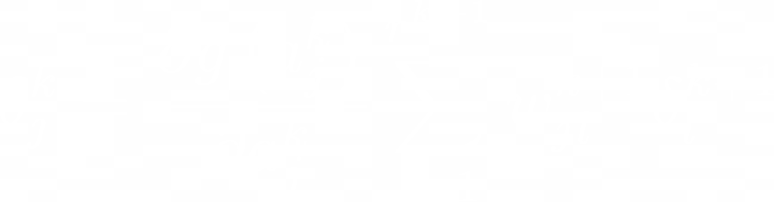

# Backpropagation 
Implementation of the back propagation algorithm from scratch on a simple regression task
## Notations:

The biases are included in the weight matrixes at each layer. Another approach would be to consider them as separate variables.
Recall that we want to minimize the loss function. Thus, we need to compute the gradient of the objective function with respect to all the parameters:

Where:

To ease calculations, we introduce the following error term:

## Output Layer

here we have k = m.

If the objective is the MSE loss, then the right term is easy to compute.

## Hidden Layers

here we have k < m:

## Application on a simple regression task:

Estimating the sinus function with a simple MultiLayer perceptron.

  
   

